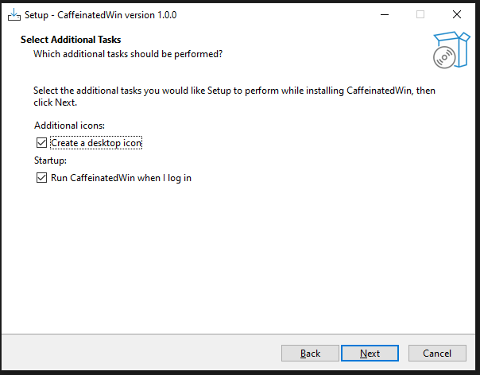

# CaffeinatedWin ☕ (Windows)

A lightweight Windows tray app that prevents your computer from sleeping — inspired by macOS `caffeinate`.

## Features
- Runs in the system tray
- Prevents system sleep
- Optional “keep display on”
- Timer mode (30 / 60 / 120 minutes)
- Optional run at startup
- Clean exit restores normal sleep behavior

## Screenshots

## Installation
1. Download the latest installer from **Releases**
2. Run `CaffeinatedWin-Setup.exe`
3. Launch from Start Menu or Desktop

## Notes
- No admin rights required
- No background services
- Uses native Windows power APIs

## License
MIT
