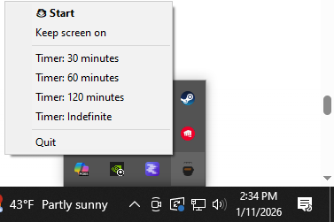

# CaffeinatedWin ☕ (Windows)

CaffeinatedWin is a lightweight Windows tray app that prevents your PC from sleeping — inspired by macOS caffeinate

## Features
- Runs in the system tray
- Prevents system sleep
- Optional “keep display on”
- Timer mode (30 / 60 / 120 minutes)
- Optional run at startup
- Clean exit restores normal sleep behavior

## Screenshots

## Installation
1. Download the latest installer from **Releases**
2. Run `CaffeinatedWin-Setup.exe`
3. Launch from Start Menu or Desktop

## Notes
- No admin rights required
- No background services
- Uses native Windows power APIs

## FAQ

**Does this install a background service?**  
No. It runs only as a tray app.

**Does it require admin privileges?**  
No.

**Is my data collected?**  
No. The app does not collect or transmit any data.

**What happens when I quit or uninstall?**  
Normal sleep behavior is fully restored.

## License
MIT
